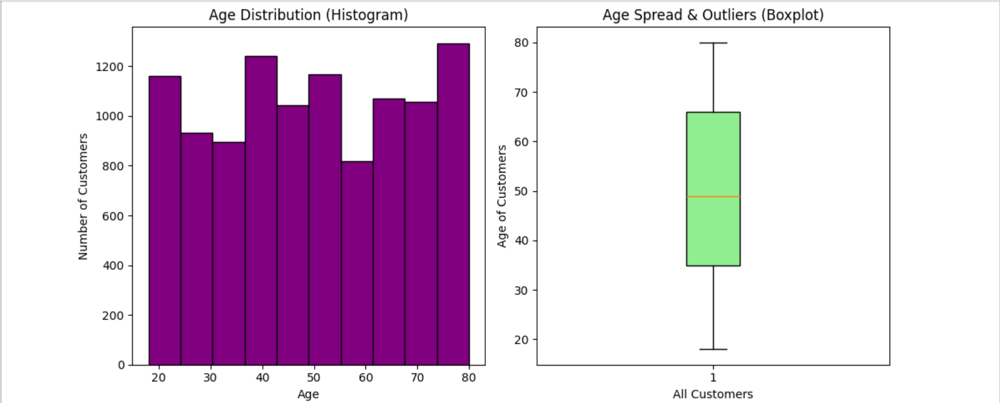
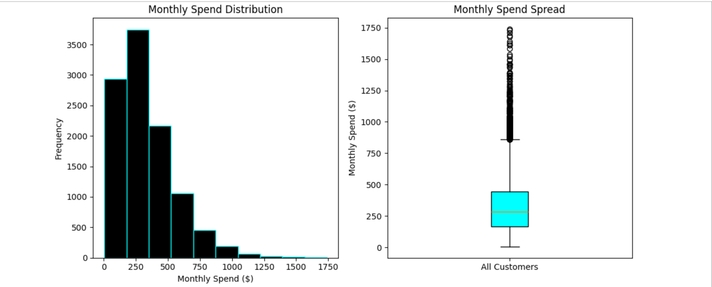
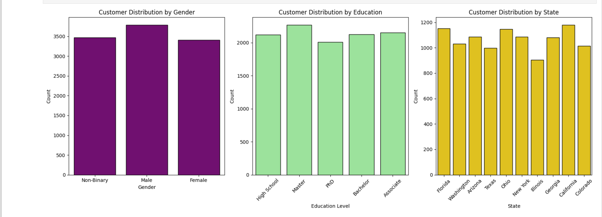
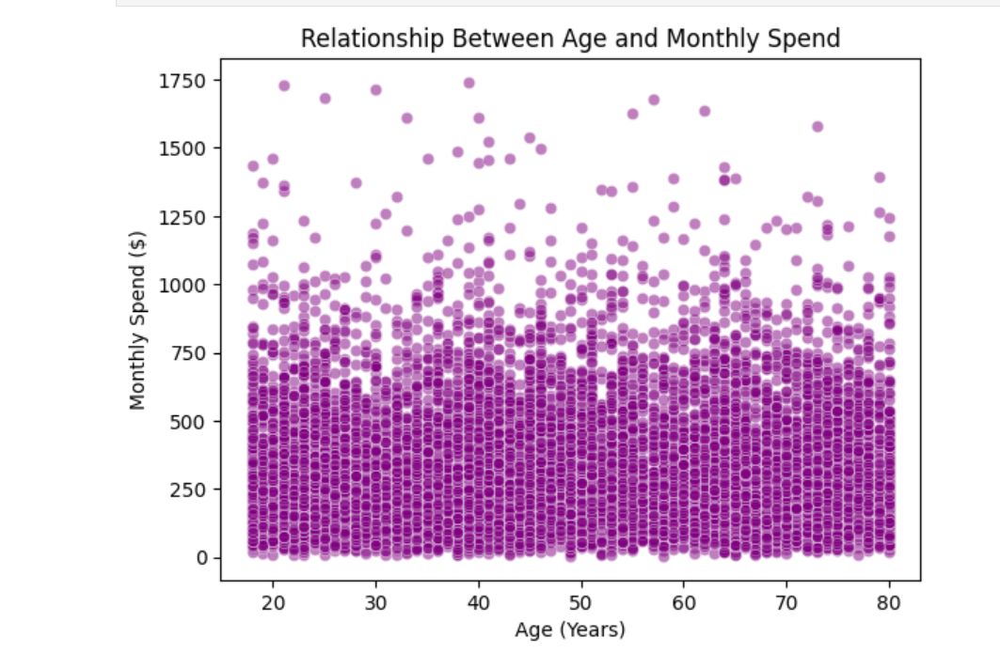
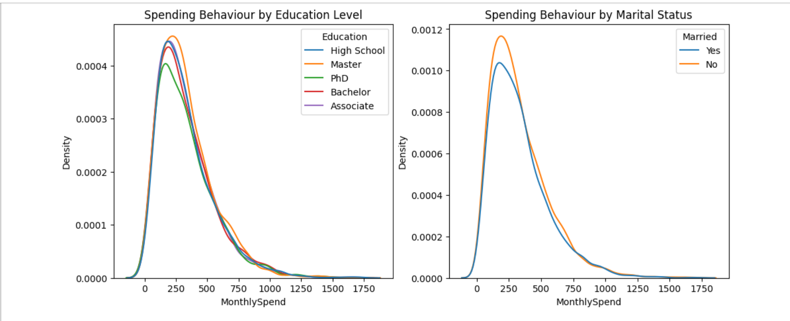
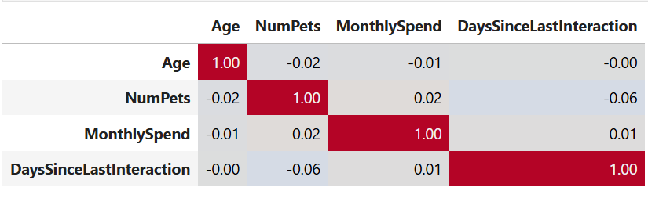
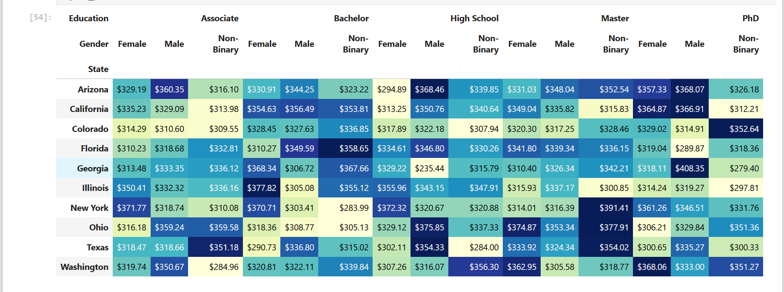
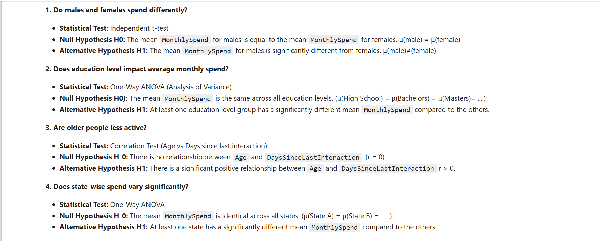
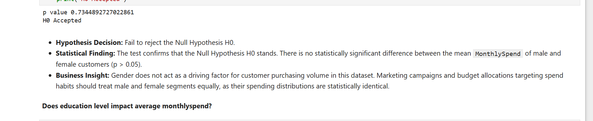
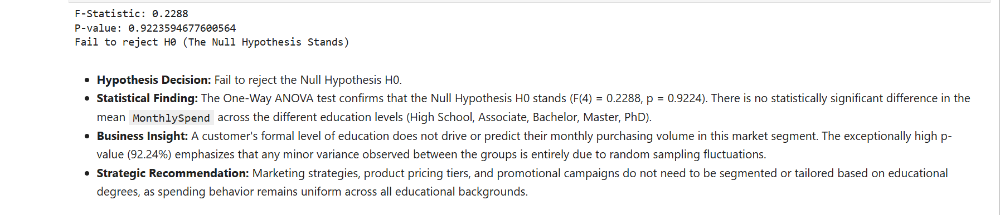

# Enterprise Consumer Demographics & Behavioral Analytics

A comprehensive data analytics repository engineered to process customer profiles, track transaction frequencies, and extract consumer purchasing patterns. This project combines exploratory data analysis (EDA), data cleaning pipelines, and Statistical analysis to deliver actionable marketing intelligence.

---

## 1. Executive Summary & Core Volume Ledgers

An audit of our active consumer database establishes a clear, real-time tracking reference framework for business operations:

*   **Total Customer Base:** 10,675 unique customer profiles processed within the analytics pipeline.
*   **Regional Geographic Footprint:** Active consumer accounts mapped across 10 distinct US states.
*   **Behavioral Tracking Matrix:** Core analysis tracking demographic features against monthly spending values and customer engagement patterns.

<table width="100%" style="border-collapse: collapse; border: none;">
  <tr style="border: none;">
    <td width="33.3%" style="padding: 5px; border: none; text-align: center; valign: top;">
      <p><b>Age Distribution Matrix</b></p>
      
    </td>
    <td width="33.3%" style="padding: 5px; border: none; text-align: center; valign: top;">
      <p><b>Monthly Spend Outlier Vector</b></p>
      
    </td>
    <td width="33.3%" style="padding: 5px; border: none; text-align: center; valign: top;">
      <p><b>Categorical Base Breakdown</b></p>
      
    </td>
  </tr>
</table>

---

## 2. Project Directory Structure

The repository files are organized according to clean production standards:

```text
ecom-consumer-demographics-analytics/
│
├── data/
│   └── us_customer_insights_dataset.csv  # Verified master consumer dataset
│
├── assets/                               # Native documentation graphics container
│   └── readme-images/                    # Local relative asset store
│
├── consumer_spend_analytics.ipynb        # Exploratory Python analytics notebook
└── consumer_behavior_executive_report.pdf # Ready-to-read executive data report
```

---

## 3. Multi-Variate Spend Features & Correlation Ledgers

To map the relationships between customer attributes and spending volumes, the pipeline processes multi-variate continuous plots and linear covariance heatmaps:

<table width="100%" style="border-collapse: collapse; border: none;">
  <tr style="border: none;">
    <td width="33.3%" style="padding: 5px; border: none; text-align: center; valign: top;">
      <p><b>Orthogonal Spend Vector</b></p>
      
    </td>
    <td width="33.3%" style="padding: 5px; border: none; text-align: center; valign: top;">
      <p><b>Multi-Class Density Waves</b></p>
      
    </td>
    <td width="33.3%" style="padding: 5px; border: none; text-align: center; valign: top;">
      <p><b>Linear Covariance Matrix</b></p>
      
    </td>
  </tr>
</table>

*   **The Orthogonality Finding:** Our correlation metrics reveal near-zero linear relationships across every feature indicator (e.g., Age vs. MonthlySpend = -0.01). 
*   **Outlier Retention Anomalies:** While the baseline portfolio clusters heavily inside the lower budget band ($100 to $500), the distribution model flags a dense trail of high-value premium anomalies stretching up to $1,750.

---

## 4. Inferential Statistics Ledger & Strategic Recommendations

To ensure marketing allocations are backed by mathematical proof rather than guesswork, the pipeline runs extensive parametric testing across all customer cohorts:

<div align="center">
  <p><b>State-Wise Distribution Matrix</b></p>
  
  <p><b>Master Insights Hypothesis Framework</b></p>
  
  <p><b>Parametric T-Test Execution Log (Gender)</b></p>
  
  <p><b>One-Way ANOVA Execution Log (Education)</b></p>
  
</div>

### Core Strategic Business Insights
1.  **Uniform Customer Spending:** Our Independent t-tests and One-Way ANOVA models successfully accepted the Null Hypothesis (H0), logging exceptionally high p-values across Gender (p=0.7345), Education (p=0.9224), and State (p=0.3457).
2.  **Marketing Cost Reductions:** Because purchasing behavior remains uniform across all demographics, the business can completely avoid costly segment-specific advertising campaigns. Resources can be safely consolidated into broad, high-budget national marketing distributions to maximize reach while lowering overhead.
3.  **Generational Interaction Tuning:** The correlation coefficient between customer age and interaction timelines is practically zero (r=0.00). Churn prevention alerts, automated win-back emails, and interaction triggers should be applied identically across all age groups.

---

## 5. Deployment Architecture

*   **Data Aggregation Core:** Engineered entirely within a Jupyter Notebook pipeline using Python.
*   **Data Manipulation Toolkits:** Managed using Pandas dataframes and NumPy array select structures.
*   **Visual Presentation Graphics:** Rendered using Matplotlib and Seaborn plotting engines.
